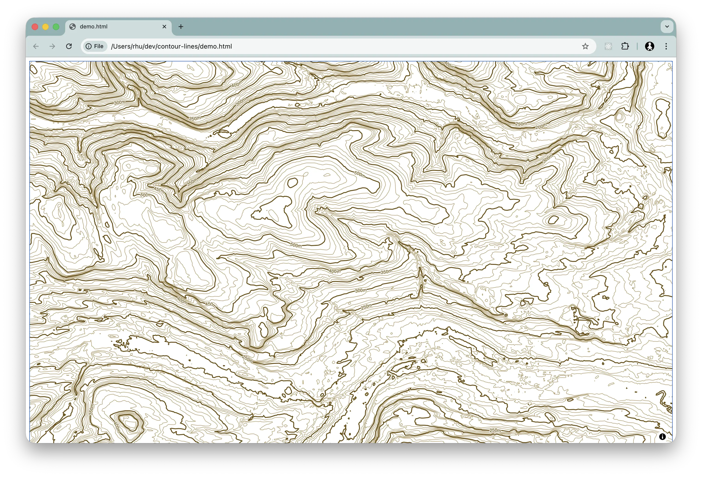

# UK Contour Lines

[](https://www.python.org/)
[](https://gdal.org/)
[](https://maplibre.org/)
[](LICENSE.md)

A complete pipeline for generating, serving, and visualizing high-resolution vector contour lines for the United Kingdom using Copernicus Global DEM data.



A development map tile server is available the supplies two vector tile sets (generated using this pipeline):

  * Contour lines (https://map-tiles.destructuring-bind.org/styles/uk_contours/style.json)
  * UK Boundary (https://map-tiles.destructuring-bind.org/styles/uk_boundary/style.json)

Please don't abuse this service: it is intended for light use only. Host the tiles yourself instead - 
re-generate them using this pipeline, or contact me and I can supply the resultant `uk_contours.mbtiles`
or `uk_boundary.mbtiles` files.

## Features

-   **High Precision**: Derived from Copernicus GLO-30 (30m resolution) digital elevation model.
-   **Vector-Based**: Smooth rendering at any zoom level using MapLibre GL.
-   **Dynamic Styling**: Includes index lines every 50m and elevation labels.
-   **Self-Hosted**: Full Docker-based serving stack using TileServer GL.
-   **Automated Workflow**: Clean `Makefile` for data processing and server management.

## Prerequisites

Ensure you have the following tools installed:

```console
# macOS (Homebrew)
brew install gdal tippecanoe make

# Docker (for serving)
brew install --cask docker
```

## Quick Start

### 1. Build the Pipeline

The entire data processing pipeline is automated. This will fetch tile URLs, build a virtual mosaic, generate contours, and encode them into optimized vector tiles (zooms 6-14).

```console
make tiles
```

### 2. Serve the Map

Run TileServer GL via Docker to host the MBTiles and styles.

```console
make serve
```

### 3. Visualize

Simply open `demo.html` in your browser. The viewer includes:
-   **Navigation Controls**: Zoom and rotation buttons.
-   **Scale Bar**: Metric scale indicator.
-   **GPU Rendering**: Fast, GPU-accelerated visualization via MapLibre GL JS.

## Technical Stack

-   **Data Source**: [Copernicus GLO-30](https://dataspace.copernicus.eu/explore-data/data-collections/copernicus-contributing-missions/collections-description/COP-DEM) (Cloud Optimized GeoTIFFs).
-   **Processing**:
    -   `GDAL`: Virtual raster handling and contour generation.
    -   `Tippecanoe`: Building optimized vector tiles (Minimum zoom 6).
-   **Automation**: `GNU Make` for dependency-aware build steps.
-   **Server**: `TileServer GL` (Docker).
-   **Frontend**: `MapLibre GL JS`.

## Styling Logic

The provided style (`data/styles/contours/style.json`) implements:
-   **Standard Lines**: Light brown lines every 10m.
-   **Index Lines**: Darker, thicker lines every 50m.
-   **Labels**: Elevation text (e.g., "250m") automatically placed along index lines.

## Attribution & License

Software is provided under the [MIT License](LICENSE.md).

> _This dataset was derived/produced using Copernicus WorldDEM-30 © DLR e.V. 2010-2014 and © Airbus Defence and Space GmbH 2014-2018 provided under COPERNICUS by the European Union and ESA; all rights reserved_

UK boundary GeoJSON sourced from: https://services1.arcgis.com/ESMARspQHYMw9BZ9/arcgis/rest/services/Countries_December_2023_Boundaries_UK_BGC/FeatureServer/0/query?outFields=*&where=1%3D1&f=geojson